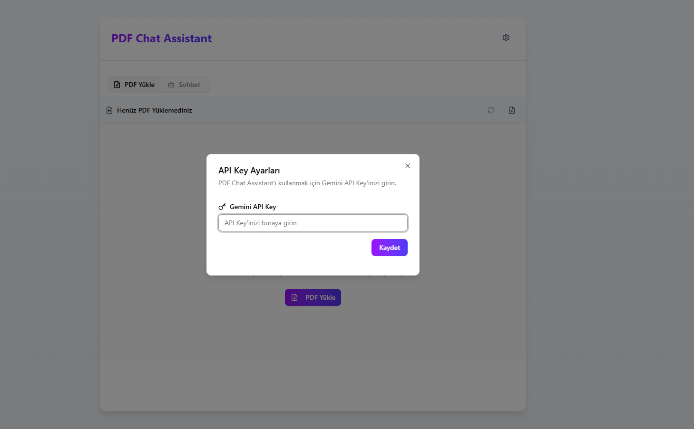
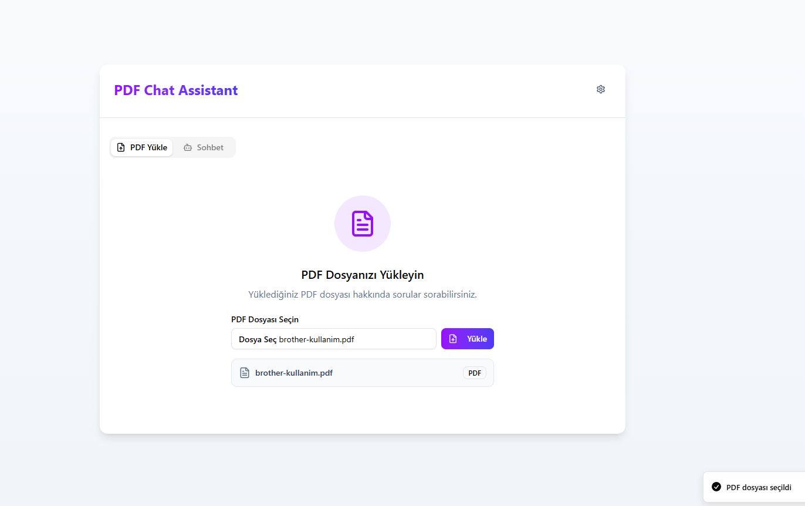
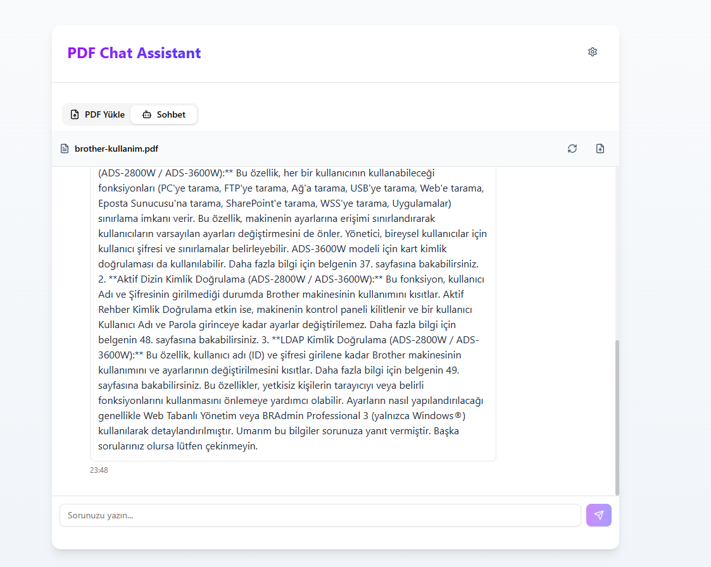

# Frontend Uygulama - Kullanım ve Kurulum

Bu dosyada, uygulamanın frontend kısmının nasıl kurulacağı ve nasıl kullanılacağı adım adım anlatılmaktadır.

---

## 🚀 Kurulum

1. Projeyi klonlayın veya ZIP olarak indirin.
2. Terminalde proje klasörüne gidin:

```bash
cd frontend
```

## Bağımlılıkları yükleyin:

```bash
npm install
# veya
yarn install
```

## Geliştirme sunucusunu başlatın:

```bash
npm run dev
# veya
yarn dev
```

## Tarayıcınızda http://localhost:3000 adresini açın.

🛠️ Uygulama Kullanımı

1. API Key Ekleme
   Uygulama açıldıktan sonra ekranda API Key girmeniz için bir alan olacaktır.

API Key'inizi ilgili kutuya yapıştırın ve onaylayın.

2. PDF Yükleme
   API Key doğrulandıktan sonra, "PDF Yükle" butonu aktif olur.

PDF dosyanızı seçin ve yükleyin.

3. Sohbet Etme
   PDF yüklendikten sonra sohbet kutusuna istediğiniz soruyu yazabilirsiniz.

Sistem, PDF içeriğine göre yanıt verecektir.

Sohbet geçmişiniz uygulama kapanana kadar saklanır.

# API Key yükleme



# PDF Yükleme



# Chat


